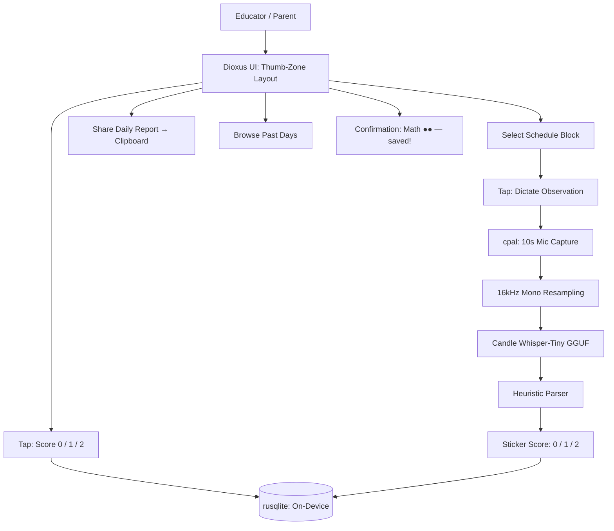

<!-- Unlicense — cochranblock.org -->

# Proof of Artifacts

*Concrete evidence that this project works, ships, and is real.*

> Voice dictation → on-device AI → behavioral sticker scoring. No cloud. No privacy leaks.

## Architecture



## Build Output

| Metric | Value |
|--------|-------|
| Lines of Rust | 1,639 across 8 files (7 modules + test binary) |
| AI model | Whisper-Tiny GGUF (on-device, no cloud) |
| UI framework | Dioxus 0.5 (pure Rust, mobile-native) |
| Audio | cpal (cross-platform mic capture) |
| Storage | rusqlite (bundled SQLite, zero external deps) |
| Unit tests | 40 (parser heuristics, DB operations, student CRUD, sticker records, daily report, undo, behavior tags, audio stubs) |
| Quality gate | TRIPLE SIMS via exopack (3-pass determinism) |
| Schedule blocks | 5 (Cultural Arts, Community Circle, Math, Recess, Lunch) |
| Sticker values | 3-tier: 0 (concern), 1 (good), 2 (great) |
| Behavior tags | 6 (elopement, refusal, combative, stay_in_space, finish_work, positive) |
| Compressed symbols | 29 functions (f119-f147), 7 types (t119-t125), 18 fields (s0-s17) |
| Dependencies (lib) | 6 (anyhow, chrono, rusqlite, serde, serde_json, tokio) |
| Federal compliance docs | 11 (govdocs/) |

## Binary Size (Release)

| Target | Artifact | Size |
|--------|----------|------|
| aarch64-apple-darwin | rlib (lib) | 420,736 bytes (411 KB) |
| aarch64-apple-darwin | test binary | 320,848 bytes (313 KB) |

Release profile: `opt-level = 'z'`, LTO, `codegen-units = 1`, `panic = 'abort'`, `strip = true`.

## QA Results (2026-03-27)

**QA Round 1:**
- `cargo build --release`: PASS (0 errors, 0 warnings)
- `cargo clippy --release -- -D warnings`: PASS
- `cargo clippy -- -W dead-code -W unused-imports`: PASS
- TRIPLE SIMS (3x cargo test): PASS (40 tests x 3 = 120 runs)
- Code cleanliness: zero TODOs, zero debug prints, zero AI slop words

**QA Round 2 (post-P13 tokenization):**
- `cargo clean && cargo build --release`: PASS
- `cargo clippy --release -- -D warnings`: PASS
- TRIPLE SIMS: PASS (40 x 3 = 120 runs)
- `cargo check` with all features (dioxus+candle+audio): PASS
- `git status`: clean

## Key Artifacts

| Artifact | Description |
|----------|-------------|
| Tap-to-Score | Manual sticker entry: tap 0/1/2 on any selected card. Works without voice pipeline |
| On-Device Whisper | Candle Whisper-Tiny GGUF — speech-to-text runs entirely on-device. No API calls, no privacy leaks |
| Heuristic Parser | great/excellent → 2 stickers, good/ok → 1 sticker, refusal/elopement → 0. Works even if Whisper fails |
| Thumb-Zone UI | All controls in bottom half of screen for one-handed use. Safe-area insets respect notches |
| Behavioral Tags | Auto-extracted from transcription: elopement, refusal, combative, finish_work, positive |
| Daily Report | Plain-text report generation: student name, date, per-block scores + notes, progress, goal status |
| Share to Clipboard | "Share Daily Report" copies formatted report to clipboard via WebView eval |
| Date Navigation | Browse past days — cards show historical scores and notes, read-only on past dates |
| Undo | "Undo" button removes last dictation entry, updates progress counter |
| Student Profile | Default student with configurable goal_stickers — dynamic goal display in UI |
| Progress Counter | `f142()` sums sticker values; UI shows "4 / 15 Stickers" with goal-met state |
| P13 Tokenization | All public symbols compressed per kova convention (f/t/s tokens) |
| TRIPLE SIMS | 3-pass test via exopack — real tempfile SQLite, no mocks |
| Feature Gates | Tests run without audio/UI libs (--no-default-features) |
| Cargo.lock | Pinned 602 dependency versions for reproducible builds |
| Federal Compliance | 11 govdocs: SBOM, SSDF, supply chain, security, accessibility, privacy, FIPS, FedRAMP, CMMC, ITAR/EAR, federal use cases |

## How to Verify

```bash
cargo build --release -p wowasticker --no-default-features
cargo test -p wowasticker --no-default-features           # 40 tests
cargo run -p wowasticker --bin wowasticker-test --features tests  # TRIPLE SIMS
```

---

*Part of the [CochranBlock](https://cochranblock.org) zero-cloud architecture. All source under the Unlicense.*
