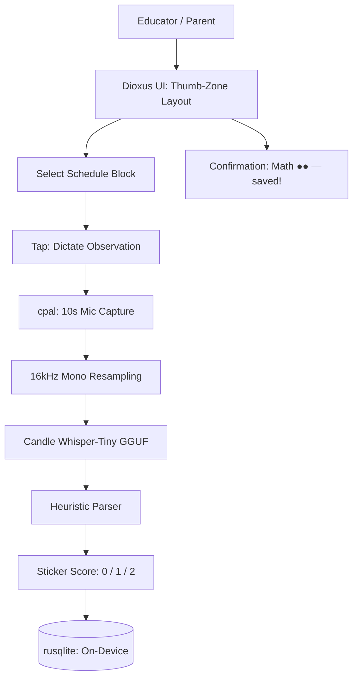

<!-- Unlicense — cochranblock.org -->

# Proof of Artifacts

*Concrete evidence that this project works, ships, and is real.*

> Voice dictation → on-device AI → behavioral sticker scoring. No cloud. No privacy leaks.

## Architecture



## Build Output

| Metric | Value |
|--------|-------|
| Lines of Rust | 962 across 6 modules |
| AI model | Whisper-Tiny GGUF (on-device, no cloud) |
| UI framework | Dioxus 0.5 (pure Rust, mobile-native) |
| Audio | cpal (cross-platform mic capture) |
| Storage | rusqlite (bundled SQLite, zero external deps) |
| Unit tests | 26 (parser heuristics, DB operations, audio stubs) |
| Quality gate | TRIPLE SIMS via exopack (3-pass determinism) |
| Schedule blocks | 5 (Cultural Arts, Community Circle, Math, Recess, Lunch) |
| Sticker values | 3-tier: 0 (concern), 1 (good), 2 (great) |
| Behavior tags | 5 (elopement, refusal, combative, finish_work, positive) |

## Key Artifacts

| Artifact | Description |
|----------|-------------|
| On-Device Whisper | Candle Whisper-Tiny GGUF — speech-to-text runs entirely on-device. No API calls, no privacy leaks |
| Heuristic Parser | great/excellent → 2 stickers, good/ok → 1 sticker, refusal/elopement → 0. Works even if Whisper fails |
| Thumb-Zone UI | All controls in bottom half of screen for one-handed use. Safe-area insets respect notches |
| Behavioral Tags | Auto-extracted from transcription: elopement, refusal, combative, finish_work, positive |
| TRIPLE SIMS | 3-pass test via exopack — real tempfile SQLite, no mocks |
| Feature Gates | Tests run without audio/UI libs (--no-default-features) |

## How to Verify

```bash
cargo build --release -p wowasticker
cargo test --no-default-features                          # 26 tests
cargo run -p wowasticker --bin wowasticker-test          # TRIPLE SIMS
```

---

*Part of the [CochranBlock](https://cochranblock.org) zero-cloud architecture. All source under the Unlicense.*
